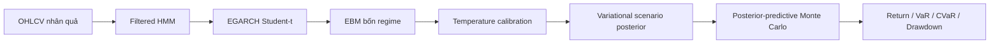

# Báo cáo RAEMF-VB-MC

Ngày chốt artifact: **25/07/2026**. Dữ liệu mới nhất trong benchmark và dự
báo live kết thúc ngày **13/07/2026**. Đây là báo cáo nghiên cứu định lượng,
không phải khuyến nghị đầu tư.

## 1. Phạm vi mô hình

RAEMF-VB-MC có hai đầu ra khác nhau:

1. EBM point-estimate xuất xác suất bốn lớp `Bull`, `Sideway`, `Bear`,
   `Stress`.
2. Variational Bayesian scenario layer lấy mẫu tham số Student-t theo regime
   cho từng Monte Carlo path để xuất phân phối lợi suất, VaR, CVaR và
   drawdown.

Filtered HMM, EGARCH recursion, EBM và temperature calibration vẫn là
point-estimate. Bayesian regime head đã được benchmark nhưng không đạt quy
tắc chọn đã đăng ký trước, nên EBM vẫn là production classifier. Vì vậy
RAEMF-VB-MC không phải fully Bayesian HMM-EGARCH.



## 2. Dữ liệu thực tế

Nguồn canonical dùng cho benchmark VB gồm **6.306 phiên** VN-Index từ
28/07/2000 đến 13/07/2026. Loader loại một bản ghi trùng hoàn toàn; hai ô
volume xung đột giữa hai nguồn được ghi trong data-merge report. Giá OHLC
trên các ngày giao nhau khớp.

| Thuộc tính | Giá trị |
| --- | --- |
| File ưu tiên | `VNINDEX_Daily.csv` |
| Số phiên canonical | 6.306 |
| Bắt đầu | 28/07/2000 |
| Kết thúc | 13/07/2026 |
| SHA-256 canonical CSV | `962c2c8e69821b572ca20034c40c4254656405b1ba9b75410396753b6d0697c5` |
| Forecast origin live | 13/07/2026 |
| VN-Index đóng cửa tại origin | 1.800,54 |

Nguồn kiểm chứng:
[data merge report](outputs/latest/data_merge_report.md),
[metadata JSON](outputs/latest/data_merge_report.json) và
[canonical data](outputs/latest/canonical_vnindex.csv).

## 3. Báo cáo TRAIN, VALID và TEST

Benchmark phân phối dùng ba expanding outer fold cho mỗi horizon. Mọi TRAIN
đều được purge bằng `target_end_date_h < validation_start`; mọi VALID được
purge bằng `target_end_date_h < test_start`. TEST không tham gia chọn prior,
model, calibration hay threshold.

| h | Fold | TRAIN | VALID | TEST | Trạng thái posterior |
| ---: | ---: | --- | --- | --- | --- |
| 20 | 0 | 28/07/2000–20/04/2016; 3.752 | 23/05/2016–22/10/2018; 608 | 20/11/2018–28/05/2021; 628 | converged |
| 20 | 1 | 28/07/2000–22/10/2018; 4.380 | 20/11/2018–28/04/2021; 608 | 31/05/2021–29/11/2023; 629 | converged |
| 20 | 2 | 28/07/2000–29/04/2021; 5.009 | 01/06/2021–01/11/2023; 608 | 30/11/2023–15/06/2026; 629 | converged |
| 40 | 0 | 28/07/2000–04/03/2016; 3.720 | 05/05/2016–04/09/2018; 586 | 31/10/2018–06/05/2021; 626 | converged |
| 40 | 1 | 28/07/2000–04/09/2018; 4.346 | 31/10/2018–08/03/2021; 586 | 07/05/2021–03/11/2023; 627 | converged |
| 40 | 2 | 28/07/2000–09/03/2021; 4.973 | 10/05/2021–08/09/2023; 586 | 06/11/2023–18/05/2026; 627 | converged |
| 60 | 0 | 28/07/2000–13/01/2016; 3.688 | 14/04/2016–17/07/2018; 564 | 11/10/2018–09/04/2021; 624 | converged |
| 60 | 1 | 28/07/2000–17/07/2018; 4.312 | 11/10/2018–08/01/2021; 564 | 12/04/2021–10/10/2023; 625 | converged |
| 60 | 2 | 28/07/2000–11/01/2021; 4.937 | 13/04/2021–14/07/2023; 564 | 11/10/2023–15/04/2026; 625 | converged |

Chi tiết máy đọc được:
[fold_metadata.csv](outputs/distribution_oos_vb/fold_metadata.csv).

### 3.1 TRAIN

TRAIN dùng để fit feature selector, Filtered HMM, EGARCH, EBM và variational
posterior. Cả 9/9 posterior fold-fit hội tụ, không có fallback. Không dùng
accuracy TRAIN làm kết quả chính vì đây là điểm in-sample và có thể lạc quan.

### 3.2 VALID

VALID dùng cho lựa chọn/calibration, không được trình bày như final OOS. Trong
protocol single-split của classifier, temperature scaling cho RAEMF-MC có kết
quả sau:

| h | Temperature | Brier trước | Brier sau | Log loss trước | Log loss sau | ECE trước | ECE sau |
| ---: | ---: | ---: | ---: | ---: | ---: | ---: | ---: |
| 20 | 2,00 | 0,7529 | 0,7447 | 1,3864 | 1,3744 | 0,0666 | 0,0142 |
| 40 | 1,30 | 0,7279 | 0,7263 | 1,3450 | 1,3410 | 0,0406 | 0,0255 |
| 60 | 1,10 | 0,7117 | 0,7118 | 1,3149 | 1,3149 | 0,0313 | 0,0434 |

Ở h60, Brier và ECE không cải thiện dù log loss giảm rất nhẹ. Artifact nguồn:
[calibration_comparison.csv](outputs/latest/calibration_comparison.csv).

### 3.3 TEST — phân loại bốn regime

Bảng dưới là trung bình ba outer TEST fold của EBM trong benchmark VB.
`n TEST` là tổng số origin test khác nhau qua ba fold.

| h | n TEST | Macro F1 | Balanced acc. | MCC | Brier | Log loss | ECE | Recall Bull | Sideway | Bear | Stress |
| ---: | ---: | ---: | ---: | ---: | ---: | ---: | ---: | ---: | ---: | ---: | ---: |
| 20 | 1.886 | 0,2192 | 0,2360 | -0,0184 | 0,7432 | 1,3690 | 0,0817 | 0,2493 | 0,3348 | 0,0667 | 0,2930 |
| 40 | 1.880 | 0,2360 | 0,2601 | 0,0364 | 0,7382 | 1,3575 | 0,0955 | 0,3887 | 0,3044 | 0,0840 | 0,2633 |
| 60 | 1.874 | 0,2183 | 0,2593 | 0,0309 | 0,7387 | 1,3578 | 0,1335 | 0,3890 | 0,2206 | 0,0741 | 0,3533 |

Khả năng nhận diện Bear vẫn thấp. Bayesian regime head có proper score tốt
hơn nhưng recall Bear gần 0, nên không thay EBM. Nguồn:
[classification_metrics.csv](outputs/distribution_oos_vb/classification_metrics.csv)
và [vb_decisions.json](outputs/latest/vb_decisions.json).

File single-split chứa từng ngày TEST, nhãn thực tế và đủ bốn xác suất:
[predictions_test.csv](outputs/latest/predictions_test.csv). Khi sử dụng, cần
lọc `model == "RAEMF-MC"`; các model đối chứng cũng được lưu trong cùng file.


**Nhận xét:** Metric TEST mới là bằng chứng chính. TRAIN là in-sample và VALID
là tập lựa chọn/calibration nên không được dùng để quảng bá chất lượng.

## 4. Xác suất bốn regime hiện tại

Đây là EBM deployment refit với hyperparameter và temperature đã khóa, dùng dữ
liệu đến 13/07/2026. Xác suất cộng thành 100% ở mỗi horizon.

| h | Bull | Sideway | Bear | Stress | Bear + Stress | Argmax | Confidence |
| ---: | ---: | ---: | ---: | ---: | ---: | --- | --- |
| 20 | 21,96% | 22,65% | 23,90% | 31,49% | 55,39% | Stress | Uncertain |
| 40 | 23,27% | 19,08% | 22,49% | 35,16% | 57,65% | Stress | Uncertain |
| 60 | 23,66% | 22,28% | 18,22% | 35,85% | 54,06% | Stress | Uncertain |

Nguồn: [current_predictions.csv](outputs/current_monitor/current_predictions.csv)
và [current_outlook.json](outputs/current_monitor/current_outlook.json).


**Nhận xét:** Stress là lớp lớn nhất nhưng chỉ đạt 31,5%–35,8%, không phải xác
suất đa số. Entropy cao và margin thấp nên cả ba horizon đều được gắn
`Uncertain`.

## 5. TEST — phân phối posterior-predictive

Benchmark so sánh:

- M0: `point_estimate`;
- M1: `posterior_mean_mc`;
- M2: `variational_posterior`, một parameter draw cố định cho mỗi MC path.

Bảng sau là M2 trên outer TEST, trung bình ba Monte Carlo seed:

| h | Origin | MAE | RMSE | Directional acc. | CRPS | WIS | Coverage 90% | Coverage 95% | VaR95 violation |
| ---: | ---: | ---: | ---: | ---: | ---: | ---: | ---: | ---: | ---: |
| 20 | 1.886 | 0,0450 | 0,0613 | 54,61% | 0,0335 | 0,0239 | 79,11% | 86,23% | 11,44% |
| 40 | 1.880 | 0,0633 | 0,0876 | 58,95% | 0,0476 | 0,0347 | 80,73% | 87,07% | 12,29% |
| 60 | 1.874 | 0,0722 | 0,0974 | 64,62% | 0,0537 | 0,0390 | 81,66% | 87,07% | 11,29% |

M2 giảm CRPS và WIS so với M0 với bootstrap CI loại 0 ở cả ba horizon, nhưng
coverage thấp hơn mức danh nghĩa và VaR95 violation cao hơn 5% kỳ vọng.
Vì vậy proper score tốt hơn không đồng nghĩa quản trị rủi ro đã calibrated.


**Nhận xét:** M0 quá rộng, còn M2 quá hẹp. Quy tắc đăng ký trước chọn
`point_estimate` ở h20/h40 và `variational_posterior` ở h60; bỏ phiếu đa số
giữ `point_estimate` làm production default.

## 6. Quản trị rủi ro

### 6.1 Rủi ro live từ variational posterior

Các số dưới đây dùng 1.500 path tại forecast origin 13/07/2026. Chưa horizon
nào đáo hạn, nên đây là đầu ra chưa thể kiểm chứng.

| h | Median return | Dải 95% | P(return < 0) | P(DD >5%) | P(DD >10%) | P(DD >15%) | VaR95 | CVaR95 |
| ---: | ---: | --- | ---: | ---: | ---: | ---: | ---: | ---: |
| 20 | +0,99% | -4,53% đến +6,59% | 32,60% | 4,53% | 0,27% | 0,00% | 3,17% | 4,97% |
| 40 | +2,25% | -5,98% đến +10,24% | 25,40% | 13,13% | 1,60% | 0,27% | 4,53% | 6,85% |
| 60 | +3,32% | -5,15% đến +12,79% | 19,40% | 17,07% | 2,33% | 0,47% | 3,44% | 6,75% |

Nguồn:
[latest_forecast_vb.json](outputs/latest/latest_forecast_vb.json),
[return quantiles](outputs/latest/latest_return_quantiles_vb.csv) và
[drawdown risk](outputs/latest/latest_drawdown_risk_vb.csv).

### 6.2 Calibration rủi ro trên TEST

| h | DD >10% thực tế | DD >10% dự báo M2 | Realized ES95 | Forecast ES95 |
| ---: | ---: | ---: | ---: | ---: |
| 20 | 11,61% | 4,02% | 10,30% | 9,18% |
| 40 | 24,04% | 8,96% | 14,35% | 12,23% |
| 60 | 34,79% | 12,51% | 17,68% | 13,76% |

M2 đánh giá thấp tần suất drawdown trên TEST. Do đó VaR/CVaR và xác suất
drawdown live chỉ là scenario research, không được dùng làm production risk
limit khi chưa hiệu chỉnh lại volatility layer.


### 6.3 Backtest classifier trên final TEST

| Cumulative return | Annual return | Volatility | Sharpe | Sortino | Max drawdown | Turnover | Cost | Average exposure |
| ---: | ---: | ---: | ---: | ---: | ---: | ---: | ---: | ---: |
| 17,59% | 3,25% | 8,26% | 0,393 | 0,457 | -19,03% | 21,58 | 2,16% | 43,06% |

Backtest dùng xác suất EBM, position trễ một phiên và transaction cost 10 bps.
Đây không phải backtest của M2 và không phản ánh tracking error, thuế, spread
biến thiên hoặc khả năng giao dịch trực tiếp VN-Index.

## 7. Quyết định production

| Thành phần | Production | Research output | Lý do |
| --- | --- | --- | --- |
| Classifier bốn regime | EBM | Bayesian regime head | Head Bayesian làm giảm recall Bear/Stress |
| Scenario mode | `point_estimate` | `posterior_mean_mc`, `variational_posterior` | M2 cải thiện CRPS/WIS nhưng under-cover |
| VaR/CVaR M2 | Không dùng làm limit mặc định | Vẫn xuất artifact | VaR95 violation TEST khoảng 11%–12% |

## 8. Reproducibility

```bash
# Point-estimate classifier và report
bash scripts/run_laptop.sh

# RAEMF-VB-MC: merge data, OOS benchmark, regime-head benchmark, live forecast
bash scripts/run_laptop_vb.sh

# Kiểm thử
conda run -n project python -m pytest -q
python -m ruff check src tests scripts
```

Profile laptop VB dùng PyTorch full-rank ADVI, ba seed `[11, 42, 73]`, shared
Student-t ν, 1.200 posterior draws, 300 path/origin trong benchmark và 1.500
path cho live forecast. PyMC/NUTS chỉ dùng validation nhỏ, không nằm trong
pipeline production.

## 9. Artifact chính

| Nội dung | Artifact |
| --- | --- |
| Báo cáo VB OOS gốc | [report.md](outputs/distribution_oos_vb/report.md) |
| TRAIN/VALID/TEST theo fold | [fold_metadata.csv](outputs/distribution_oos_vb/fold_metadata.csv) |
| Metric phân loại TEST | [classification_metrics.csv](outputs/distribution_oos_vb/classification_metrics.csv) |
| Metric phân phối TEST | [distribution_metrics_summary.csv](outputs/distribution_oos_vb/distribution_metrics_summary.csv) |
| Bootstrap paired | [bootstrap_distribution_differences.csv](outputs/distribution_oos_vb/bootstrap_distribution_differences.csv) |
| Xác suất bốn lớp từng ngày single-split TEST | [predictions_test.csv](outputs/latest/predictions_test.csv) |
| Xác suất bốn lớp live | [current_predictions.csv](outputs/current_monitor/current_predictions.csv) |
| Risk live M2 | [latest_drawdown_risk_vb.csv](outputs/latest/latest_drawdown_risk_vb.csv) |
| Quyết định đã đăng ký trước | [vb_decisions.json](outputs/latest/vb_decisions.json) |

## 10. Giới hạn

- Dữ liệu chỉ gồm OHLCV VN-Index; chưa có vĩ mô, market breadth, tin tức hoặc
  thay đổi thành phần chỉ số.
- EBM nhận diện Bear yếu trên OOS.
- M2 under-cover và đánh giá thấp drawdown frequency trên TEST.
- Live forecast ngày 13/07/2026 chưa đủ 20/40/60 phiên để chấm.
- VN-Index không phải tài sản có thể giao dịch trực tiếp theo backtest đơn
  giản.
- Các xác suất và risk quantities là ước lượng mô hình, không phải cam kết về
  tương lai.
