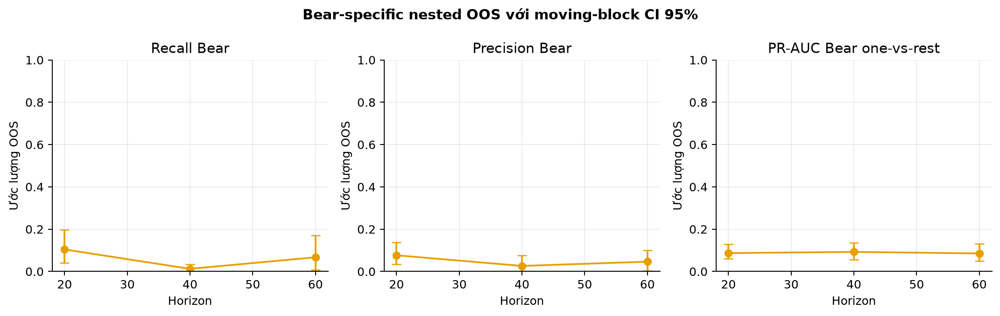
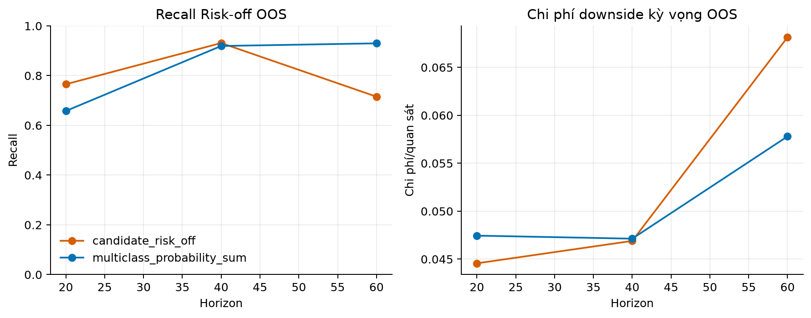
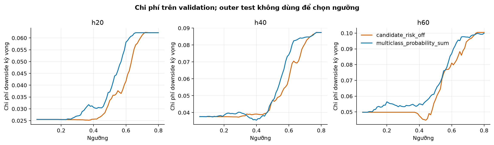
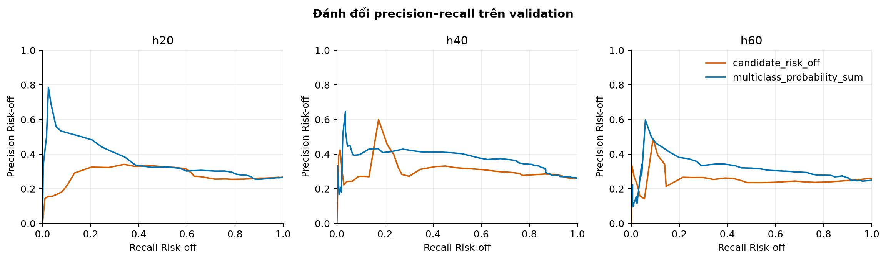
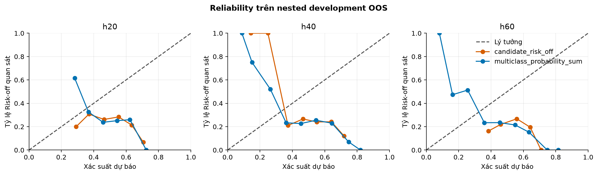

# CPU downside experiment — experimental, not production

Báo cáo nghiên cứu trung lập. Kết quả không phải khuyến nghị đầu tư và không được dùng để tự động thay mô hình production.

## 1. Thiết kế thử nghiệm

Evaluation scope: `nested_purged_development_oos`. Mọi target development phải kết thúc trước 2021-04-02. Outer test không tham gia feature selection, calibration hoặc threshold selection.

## 2. Tình trạng baseline

Baseline Risk-off được giữ nguyên là `P(Bear) + P(Stress)` từ EBM bốn lớp. Giai đoạn từ 2021-04-02 chỉ là `legacy_audit_test`, không phải untouched holdout mới.

| model | horizon | recall | precision | pr_auc | brier | ece | expected_cost | alert_fraction |
| --- | --- | --- | --- | --- | --- | --- | --- | --- |
| candidate_risk_off | 20 | 0.7654 | 0.2211 | 0.2331 | 0.2913 | 0.3066 | 0.0446 | 0.8256 |
| candidate_risk_off | 40 | 0.9311 | 0.2402 | 0.2582 | 0.2919 | 0.3173 | 0.0469 | 0.9636 |
| candidate_risk_off | 60 | 0.7154 | 0.2841 | 0.2320 | 0.2977 | 0.3474 | 0.0681 | 0.7025 |
| multiclass_probability_sum | 20 | 0.6579 | 0.2286 | 0.2952 | 0.2577 | 0.2517 | 0.0475 | 0.7109 |
| multiclass_probability_sum | 40 | 0.9192 | 0.2559 | 0.2548 | 0.2686 | 0.2763 | 0.0471 | 0.8916 |
| multiclass_probability_sum | 60 | 0.9299 | 0.2337 | 0.2275 | 0.2728 | 0.2957 | 0.0578 | 0.9175 |

### Xác suất đầy đủ và nhận diện Bear

Artifact `multiclass_oos_probabilities.csv` có 4455 dòng OOS. Mỗi dòng lưu đủ xác suất raw và temperature-calibrated cho `Bull/Sideway/Bear/Stress`, actual/predicted class, xác suất Risk-off baseline/candidate, threshold và alert. Các target downside còn lại là nhãn nghiên cứu, không được trình bày như xác suất nếu chưa fit head riêng.

| model | horizon | macro_f1 | balanced_accuracy | recall_bear | recall_stress | brier | ece |
| --- | --- | --- | --- | --- | --- | --- | --- |
| multiclass_ebm_baseline | 20 | 0.2051 | 0.2281 | 0.1116 | 0.3073 | 0.7646 | 0.1129 |
| multiclass_ebm_baseline | 40 | 0.2296 | 0.2584 | 0.0118 | 0.3971 | 0.7754 | 0.1784 |
| multiclass_ebm_baseline | 60 | 0.2464 | 0.2935 | 0.0942 | 0.3975 | 0.7722 | 0.1935 |

| horizon | actual_bear | predicted_bull | predicted_sideway | predicted_bear | predicted_stress | recall_bear |
| --- | --- | --- | --- | --- | --- | --- |
| 20.0000 | 144.0000 | 44.0000 | 34.0000 | 15.0000 | 51.0000 | 0.1042 |
| 40.0000 | 160.0000 | 57.0000 | 60.0000 | 2.0000 | 41.0000 | 0.0125 |
| 60.0000 | 134.0000 | 37.0000 | 53.0000 | 9.0000 | 35.0000 | 0.0672 |

| horizon | class | metric | estimate | ci_low | ci_high | support | replicates | block_length |
| --- | --- | --- | --- | --- | --- | --- | --- | --- |
| 20 | Bear | recall | 0.1042 | 0.0410 | 0.1962 | 144 | 300 | 20 |
| 20 | Bear | precision | 0.0765 | 0.0334 | 0.1373 | 144 | 300 | 20 |
| 20 | Bear | f1 | 0.0882 | 0.0373 | 0.1527 | 144 | 300 | 20 |
| 20 | Bear | pr_auc | 0.0869 | 0.0600 | 0.1282 | 144 | 300 | 20 |
| 20 | Bear | brier | 0.1082 | 0.0935 | 0.1272 | 144 | 300 | 20 |
| 40 | Bear | recall | 0.0125 | 0.0000 | 0.0350 | 160 | 300 | 20 |
| 40 | Bear | precision | 0.0263 | 0.0000 | 0.0759 | 160 | 300 | 20 |
| 40 | Bear | f1 | 0.0169 | 0.0000 | 0.0478 | 160 | 300 | 20 |
| 40 | Bear | pr_auc | 0.0927 | 0.0555 | 0.1358 | 160 | 300 | 20 |
| 40 | Bear | brier | 0.1109 | 0.0798 | 0.1444 | 160 | 300 | 20 |
| 60 | Bear | recall | 0.0672 | 0.0070 | 0.1718 | 134 | 300 | 20 |
| 60 | Bear | precision | 0.0464 | 0.0044 | 0.1003 | 134 | 300 | 20 |
| 60 | Bear | f1 | 0.0549 | 0.0059 | 0.1219 | 134 | 300 | 20 |
| 60 | Bear | pr_auc | 0.0853 | 0.0490 | 0.1315 | 134 | 300 | 20 |
| 60 | Bear | brier | 0.1007 | 0.0701 | 0.1367 | 134 | 300 | 20 |

**Nhận xét:** Số Bear nhận đúng/số Bear thực tế là h20: 15/144; h40: 2/160; h60: 9/134. Recall Bear thấp ở mọi horizon trong run này. Các quan sát còn lại bị chuyển sang Bull, Sideway hoặc Stress. Binary Risk-off head chỉ ước lượng `P(Bear hoặc Stress)`, không xuất riêng `P(Bear)` nên không chứng minh Bear đã cải thiện. Khoảng tin cậy dùng moving-block bootstrap trên development OOS; legacy audit không tham gia tuning hay kết luận cải thiện.

## 3. Tác động của Risk-off head

**Nhận xét:** Bảng là nguồn số chính; hình chỉ trực quan hóa recall và expected cost. Không kết luận cải thiện nếu bootstrap hoặc consistency theo fold không đạt.

## 4. Threshold được chọn và lý do

Có 9 quyết định fold/horizon. Mỗi threshold được chọn trên outer validation. Khi ràng buộc precision/recall thất bại, artifact ghi rõ `constraint_failure_minimum_expected_cost`.

Điểm cực tiểu trên curve chỉ là validation estimate; outer-test metrics không dùng để dịch chuyển threshold.

## 5. Precision–recall trade-off

Threshold thấp có thể tăng recall nhưng cũng tăng false-positive exposure. Acceptance criteria yêu cầu precision tối thiểu 25%.

## 6. Expected cost

Expected cost dùng độ lớn `abs(min(future_mae, 0))` cho false negative và `max(forward_return, 0)` cho false positive, không chỉ đếm lỗi.

## 7. False negative nguy hiểm nhất

| date | horizon | fold | model | actual_risk_off | probability | threshold | alert | forward_return | future_mae |
| --- | --- | --- | --- | --- | --- | --- | --- | --- | --- |
| 2015-11-13 | 20 | 0 | candidate_risk_off | 1 | 0.3549 | 0.3700 | 0 | -0.0815 | -0.0857 |
| 2015-11-16 | 20 | 0 | candidate_risk_off | 1 | 0.2953 | 0.3700 | 0 | -0.0803 | -0.0824 |
| 2018-06-11 | 20 | 1 | multiclass_probability_sum | 1 | 0.4164 | 0.4700 | 0 | -0.1270 | -0.1443 |
| 2018-06-08 | 20 | 1 | multiclass_probability_sum | 1 | 0.3924 | 0.4700 | 0 | -0.1244 | -0.1443 |
| 2018-06-13 | 20 | 1 | multiclass_probability_sum | 1 | 0.4322 | 0.4700 | 0 | -0.1431 | -0.1431 |
| 2018-06-07 | 20 | 1 | multiclass_probability_sum | 1 | 0.4048 | 0.4700 | 0 | -0.1421 | -0.1421 |
| 2018-05-15 | 20 | 1 | multiclass_probability_sum | 1 | 0.4393 | 0.4700 | 0 | -0.0504 | -0.1416 |
| 2018-05-14 | 20 | 1 | multiclass_probability_sum | 1 | 0.4073 | 0.4700 | 0 | -0.0266 | -0.1355 |
| 2018-06-06 | 20 | 1 | multiclass_probability_sum | 1 | 0.3952 | 0.4700 | 0 | -0.1228 | -0.1326 |
| 2018-05-07 | 20 | 1 | multiclass_probability_sum | 1 | 0.3912 | 0.4700 | 0 | -0.0467 | -0.1311 |
| 2018-05-08 | 20 | 1 | multiclass_probability_sum | 1 | 0.4192 | 0.4700 | 0 | -0.0362 | -0.1294 |
| 2018-06-15 | 20 | 1 | multiclass_probability_sum | 1 | 0.4444 | 0.4700 | 0 | -0.1110 | -0.1294 |
| 2018-06-14 | 20 | 1 | multiclass_probability_sum | 1 | 0.4392 | 0.4700 | 0 | -0.1226 | -0.1286 |
| 2018-04-20 | 20 | 1 | multiclass_probability_sum | 1 | 0.4622 | 0.4700 | 0 | -0.1243 | -0.1274 |
| 2018-06-12 | 20 | 1 | multiclass_probability_sum | 1 | 0.4327 | 0.4700 | 0 | -0.1136 | -0.1266 |

## 8. False positive tốn kém nhất

| date | horizon | fold | model | actual_risk_off | probability | threshold | alert | forward_return | future_mae |
| --- | --- | --- | --- | --- | --- | --- | --- | --- | --- |
| 2015-05-18 | 20 | 0 | multiclass_probability_sum | 0 | 0.6100 | 0.4200 | 1 | 0.1032 | 0.0148 |
| 2015-06-16 | 20 | 0 | multiclass_probability_sum | 0 | 0.5597 | 0.4200 | 1 | 0.0958 | -0.0026 |
| 2015-06-09 | 20 | 0 | multiclass_probability_sum | 0 | 0.5470 | 0.4200 | 1 | 0.0927 | -0.0006 |
| 2015-06-17 | 20 | 0 | multiclass_probability_sum | 0 | 0.5597 | 0.4200 | 1 | 0.0861 | 0.0026 |
| 2016-04-19 | 20 | 0 | multiclass_probability_sum | 0 | 0.5432 | 0.4200 | 1 | 0.0858 | -0.0004 |
| 2015-08-24 | 20 | 0 | multiclass_probability_sum | 0 | 0.5585 | 0.4200 | 1 | 0.0842 | 0.0058 |
| 2015-06-10 | 20 | 0 | multiclass_probability_sum | 0 | 0.5235 | 0.4200 | 1 | 0.0820 | 0.0083 |
| 2015-06-26 | 20 | 0 | multiclass_probability_sum | 0 | 0.5990 | 0.4200 | 1 | 0.0817 | 0.0166 |
| 2015-05-15 | 20 | 0 | multiclass_probability_sum | 0 | 0.5537 | 0.4200 | 1 | 0.0809 | -0.0159 |
| 2016-01-22 | 20 | 0 | multiclass_probability_sum | 0 | 0.4774 | 0.4200 | 1 | 0.0807 | 0.0268 |
| 2016-04-05 | 20 | 0 | multiclass_probability_sum | 0 | 0.5675 | 0.4200 | 1 | 0.0792 | 0.0132 |
| 2016-04-20 | 20 | 0 | multiclass_probability_sum | 0 | 0.5633 | 0.4200 | 1 | 0.0791 | 0.0135 |
| 2016-04-04 | 20 | 0 | multiclass_probability_sum | 0 | 0.5868 | 0.4200 | 1 | 0.0790 | 0.0081 |
| 2015-06-15 | 20 | 0 | multiclass_probability_sum | 0 | 0.4907 | 0.4200 | 1 | 0.0780 | -0.0131 |
| 2015-05-19 | 20 | 0 | multiclass_probability_sum | 0 | 0.5929 | 0.4200 | 1 | 0.0780 | 0.0244 |

## 9. Feature ablation

| horizon | outer_fold | model_kind | feature_group | objective | recall | precision | pr_auc | brier | ece | expected_cost | admissible | constraint_failures | inner_folds |
| --- | --- | --- | --- | --- | --- | --- | --- | --- | --- | --- | --- | --- | --- |
| 60 | 0 | hist_gradient_boosting | base | 0.3561 | 1.0000 | 0.5445 | 0.7108 | 0.2860 | 0.2768 | 0.0257 | False | brier_tolerance_exceeded | 2 |
| 20 | 1 | hist_gradient_boosting | base_plus_downside_all | 0.3662 | 0.9490 | 0.4182 | 0.4372 | 0.3330 | 0.3525 | 0.0130 | False | brier_tolerance_exceeded;recall_below_baseline | 2 |
| 20 | 1 | hist_gradient_boosting | base_plus_downside_price | 0.3675 | 0.9490 | 0.4182 | 0.4344 | 0.3366 | 0.3596 | 0.0130 | False | brier_tolerance_exceeded;recall_below_baseline | 2 |
| 60 | 0 | ebm | base_plus_downside_price | 0.3745 | 0.9787 | 0.5445 | 0.6589 | 0.3334 | 0.3205 | 0.0250 | False | brier_tolerance_exceeded;recall_below_baseline | 2 |
| 60 | 0 | ebm | base_plus_downside_all | 0.3763 | 0.9840 | 0.5403 | 0.6594 | 0.3244 | 0.3146 | 0.0259 | False | brier_tolerance_exceeded | 2 |
| 60 | 0 | hist_gradient_boosting | base_plus_downside_price | 0.3773 | 0.9840 | 0.5544 | 0.6242 | 0.2981 | 0.2824 | 0.0262 | False | brier_tolerance_exceeded | 2 |
| 60 | 0 | hist_gradient_boosting | base_plus_downside_all | 0.3797 | 1.0000 | 0.5513 | 0.6144 | 0.3020 | 0.2908 | 0.0267 | False | brier_tolerance_exceeded | 2 |
| 20 | 1 | hist_gradient_boosting | base | 0.3902 | 0.9323 | 0.3679 | 0.3747 | 0.3388 | 0.3456 | 0.0139 | False | brier_tolerance_exceeded;recall_below_baseline | 2 |
| 60 | 0 | logistic | base_plus_downside_price | 0.4013 | 0.9876 | 0.5087 | 0.5959 | 0.2901 | 0.2247 | 0.0286 | False | brier_tolerance_exceeded;recall_below_baseline | 2 |
| 40 | 1 | ebm | base_plus_downside_price | 0.4056 | 0.9499 | 0.3123 | 0.4279 | 0.3427 | 0.3792 | 0.0208 | False | brier_tolerance_exceeded;precision_below_minimum | 2 |
| 60 | 0 | logistic | base_plus_downside_all | 0.4070 | 0.9752 | 0.5113 | 0.5753 | 0.2842 | 0.2218 | 0.0289 | False | brier_tolerance_exceeded;recall_below_baseline | 2 |
| 20 | 0 | logistic | base_plus_downside_all | 0.4081 | 0.9958 | 0.4298 | 0.4697 | 0.3129 | 0.2751 | 0.0244 | False | brier_tolerance_exceeded | 2 |
| 60 | 0 | ebm | base | 0.4093 | 0.9947 | 0.5025 | 0.6297 | 0.3394 | 0.3180 | 0.0296 | False | brier_tolerance_exceeded | 2 |
| 20 | 1 | ebm | base_plus_downside_all | 0.4096 | 0.8920 | 0.3574 | 0.4225 | 0.3801 | 0.4198 | 0.0169 | False | brier_tolerance_exceeded;recall_below_baseline | 2 |
| 20 | 0 | logistic | base_plus_downside_price | 0.4097 | 0.9800 | 0.4307 | 0.4778 | 0.3153 | 0.2875 | 0.0244 | False | brier_tolerance_exceeded;recall_below_baseline | 2 |
| 60 | 1 | hist_gradient_boosting | base | 0.4144 | 1.0000 | 0.3095 | 0.3103 | 0.4051 | 0.4621 | 0.0184 | False | brier_tolerance_exceeded;precision_below_minimum | 2 |
| 60 | 0 | logistic | base | 0.4147 | 0.9947 | 0.5016 | 0.5945 | 0.3268 | 0.2632 | 0.0301 | False | brier_tolerance_exceeded | 2 |
| 20 | 1 | ebm | base_plus_downside_price | 0.4263 | 0.9028 | 0.3471 | 0.3664 | 0.3896 | 0.4230 | 0.0176 | False | brier_tolerance_exceeded;recall_below_baseline | 2 |
| 40 | 1 | ebm | base | 0.4351 | 0.8363 | 0.3205 | 0.3982 | 0.3626 | 0.4135 | 0.0212 | False | brier_tolerance_exceeded;precision_below_minimum;recall_below_baseline | 2 |
| 20 | 1 | ebm | base | 0.4355 | 0.8464 | 0.3508 | 0.3974 | 0.4050 | 0.4482 | 0.0184 | False | brier_tolerance_exceeded;recall_below_baseline | 2 |

Ablation chạy theo nhóm feature trong inner purged folds; outer test không chọn feature.

## 10. Calibration

Calibration được fit trên validation của từng outer fold. Reliability trong hình dùng outer development OOS.

## 11. Backtest risk overlay

| model | cumulative_return | annualized_return | annualized_volatility | sharpe | sortino | calmar | max_drawdown | turnover | total_transaction_cost | hit_rate | average_exposure | time_in_market | state_changes | cvar_95 | time_in_risk_reduced_state | avoided_loss | opportunity_cost |
| --- | --- | --- | --- | --- | --- | --- | --- | --- | --- | --- | --- | --- | --- | --- | --- | --- | --- |
| baseline_no_overlay | 0.3038 | 0.0448 | 0.0764 | 0.5868 | 0.6576 | 0.1819 | -0.2464 | 38.5286 | 0.0385 | 0.5587 | 0.4174 | 0.9993 | 1490 | 0.0128 | 0.0000 | nan | nan |
| baseline_risk_overlay | 0.0777 | 0.0126 | 0.0351 | 0.3599 | 0.3664 | 0.1036 | -0.1221 | 31.8642 | 0.0319 | 0.5553 | 0.1547 | 0.9993 | 1490 | 0.0060 | 1.0000 | 1.3558 | 1.5467 |
| buy_and_hold | 1.0346 | 0.1201 | 0.1774 | 0.6769 | 0.7830 | 0.2652 | -0.4526 | 1.0000 | 0.0010 | 0.5607 | 0.9993 | 0.9993 | 1 | 0.0296 | 0.0000 | nan | nan |
| cash | 0.0000 | 0.0000 | 0.0000 | 0.0000 | 0.0000 | 0.0000 | 0.0000 | 0.0000 | 0.0000 | 0.0000 | 0.0000 | 0.0000 | 0 | -0.0000 | 0.0000 | nan | nan |

Overlay chỉ là paper overlay, dùng vị thế trễ một phiên và notional exposure. Không được thay notional bằng tiền ký quỹ futures.

## 12. Runtime và RAM trên CPU

| stage | horizon | fold | wall_time | cpu_time | peak_rss | peak_python_bytes | cache_status | thread_count |
| --- | --- | --- | --- | --- | --- | --- | --- | --- |
| load_and_targets | nan | nan | 13.4063 | 13.3594 | 242388992 | 9439114 | targets:hit;features:hit | 4 |
| outer_fold | 20.0000 | 0.0000 | 273.0104 | 317.6562 | 314781696 | 63072420 | fold_indices:hit;hmm_egarch:hit | 4 |
| outer_fold | 20.0000 | 1.0000 | 332.9595 | 462.2031 | 328675328 | 67017673 | fold_indices:hit;hmm_egarch:hit | 4 |
| outer_fold | 20.0000 | 2.0000 | 310.8261 | 359.9375 | 339152896 | 72117672 | fold_indices:hit;hmm_egarch:hit | 4 |
| outer_fold | 40.0000 | 0.0000 | 275.8474 | 322.3125 | 339152896 | 61541856 | fold_indices:hit;hmm_egarch:hit | 4 |
| outer_fold | 40.0000 | 1.0000 | 291.0367 | 339.1406 | 339152896 | 66501896 | fold_indices:hit;hmm_egarch:hit | 4 |
| outer_fold | 40.0000 | 2.0000 | 325.0271 | 436.0781 | 348954624 | 71555564 | fold_indices:hit;hmm_egarch:hit | 4 |
| outer_fold | 60.0000 | 0.0000 | 296.6915 | 400.7969 | 348954624 | 60931290 | fold_indices:hit;hmm_egarch:hit | 4 |
| outer_fold | 60.0000 | 1.0000 | 695.9118 | 733.6562 | 348954624 | 65941035 | fold_indices:hit;hmm_egarch:hit | 4 |
| outer_fold | 60.0000 | 2.0000 | 385.7094 | 407.1719 | 354332672 | 71132908 | fold_indices:hit;hmm_egarch:hit | 4 |
| post_selection_legacy_audit | nan | nan | 136.1045 | 163.0000 | 373919744 | 60140077 | not_applicable | 4 |

Không phát hiện stage có wall time lớn hơn 4 lần CPU time.

Runner downside không gọi CUDA. `peak_rss=not_available` nghĩa là môi trường thiếu psutil; `peak_python_bytes` vẫn được ghi và giới hạn này phải được nêu rõ.

## 13. Giới hạn nghiên cứu

- Legacy audit đã được quan sát trước và không thể khôi phục thành holdout unbiased.
- Nhãn Risk-off phụ thuộc target bốn lớp hiện tại; binary target không đổi nghĩa bốn lớp.
- OHLCV không bao phủ vĩ mô, breadth, tin tức hoặc đổi thành phần chỉ số.
- Candidate tăng recall nhưng vi phạm precision, cost, calibration hoặc fold consistency vẫn phải bị loại.

### Post-selection legacy audit

| model | horizon | fold | n_obs | threshold | recall | precision | f1 | specificity | false_negative_rate | false_positive_rate | pr_auc | roc_auc | brier | log_loss | ece | calibration_slope | calibration_intercept | expected_false_negative_loss | expected_false_positive_opportunity_cost | expected_cost | worst_missed_drawdown | mean_missed_drawdown | alert_fraction | tp | fp | fn | tn | evaluation_scope |
| --- | --- | --- | --- | --- | --- | --- | --- | --- | --- | --- | --- | --- | --- | --- | --- | --- | --- | --- | --- | --- | --- | --- | --- | --- | --- | --- | --- | --- |
| multiclass_probability_sum | 20 | -1 | 1296 | 0.4600 | 0.5804 | 0.2806 | 0.3783 | 0.4792 | 0.4196 | 0.5208 | 0.3373 | 0.5548 | 0.2340 | 0.6609 | 0.2108 | 1.1843 | -0.9130 | 0.0103 | 0.0128 | 0.0437 | 0.2223 | 0.0945 | 0.5363 | 195 | 500 | 141 | 460 | post_selection_legacy_audit |
| candidate_risk_off | 20 | -1 | 1296 | 0.3700 | 0.9940 | 0.2585 | 0.4103 | 0.0021 | 0.0060 | 0.9979 | 0.3695 | 0.5595 | 0.2568 | 0.7070 | 0.2665 | 0.7839 | -1.1060 | 0.0001 | 0.0247 | 0.0251 | 0.0919 | 0.0909 | 0.9969 | 334 | 958 | 2 | 2 | post_selection_legacy_audit |
| multiclass_probability_sum | 40 | -1 | 1276 | 0.3900 | 0.7957 | 0.2557 | 0.3870 | 0.2151 | 0.2043 | 0.7849 | 0.3189 | 0.5682 | 0.2284 | 0.6498 | 0.2123 | 0.5836 | -0.9728 | 0.0074 | 0.0289 | 0.0510 | 0.2631 | 0.1426 | 0.7876 | 257 | 748 | 66 | 205 | post_selection_legacy_audit |
| candidate_risk_off | 40 | -1 | 1276 | 0.2900 | 0.9969 | 0.2525 | 0.4030 | 0.0000 | 0.0031 | 1.0000 | 0.2767 | 0.5547 | 0.2458 | 0.6849 | 0.2390 | 0.3657 | -1.0676 | 0.0001 | 0.0362 | 0.0366 | 0.1634 | 0.1634 | 0.9992 | 322 | 953 | 1 | 0 | post_selection_legacy_audit |
| multiclass_probability_sum | 60 | -1 | 1256 | 0.3500 | 0.9269 | 0.2317 | 0.3708 | 0.0314 | 0.0731 | 0.9686 | 0.2261 | 0.4693 | 0.2334 | 0.6597 | 0.2131 | -0.6997 | -1.3053 | 0.0024 | 0.0424 | 0.0496 | 0.1635 | 0.1370 | 0.9586 | 279 | 925 | 22 | 30 | post_selection_legacy_audit |
| candidate_risk_off | 60 | -1 | 1256 | 0.4900 | 0.1628 | 0.1476 | 0.1548 | 0.7037 | 0.8372 | 0.2963 | 0.1916 | 0.4031 | 0.2377 | 0.6680 | 0.2174 | -1.0098 | -1.3452 | 0.0371 | 0.0134 | 0.1247 | 0.3460 | 0.1849 | 0.2643 | 49 | 283 | 252 | 672 | post_selection_legacy_audit |

Legacy audit không tham gia chọn model, calibration, threshold hoặc acceptance.

## 14. Điều kiện được phép chạy shadow test

Trạng thái: `inconclusive_or_rejected`; đạt 3/10 kiểm tra đã đăng ký trước. Candidate không tự động thay production classifier hoặc scenario mode.

Chỉ forecast mới, đăng ký bất biến và chấm sau maturity mới tạo bằng chứng prospective.

## 15. Điều kiện chưa được phép dùng tiền thật

Không dùng tiền thật khi acceptance chưa đạt, bootstrap còn inconclusive, registry chưa có đủ forecast matured hoặc distribution calibration/VaR production chưa đạt. Repository không tự động cấp quyền production.

## Phụ lục bootstrap

| horizon | candidate | baseline | metric | mean_difference | ci_low | ci_high | ci_excludes_zero |
| --- | --- | --- | --- | --- | --- | --- | --- |
| 20 | candidate_risk_off | multiclass_probability_sum | recall | 0.0865 | -0.0183 | 0.2173 | False |
| 20 | candidate_risk_off | multiclass_probability_sum | expected_cost | -0.0028 | -0.0125 | 0.0075 | False |
| 40 | candidate_risk_off | multiclass_probability_sum | recall | 0.0044 | -0.0733 | 0.0731 | False |
| 40 | candidate_risk_off | multiclass_probability_sum | expected_cost | -0.0004 | -0.0082 | 0.0064 | False |
| 60 | candidate_risk_off | multiclass_probability_sum | recall | -0.2229 | -0.4035 | -0.0608 | True |
| 60 | candidate_risk_off | multiclass_probability_sum | expected_cost | 0.0108 | -0.0067 | 0.0333 | False |
